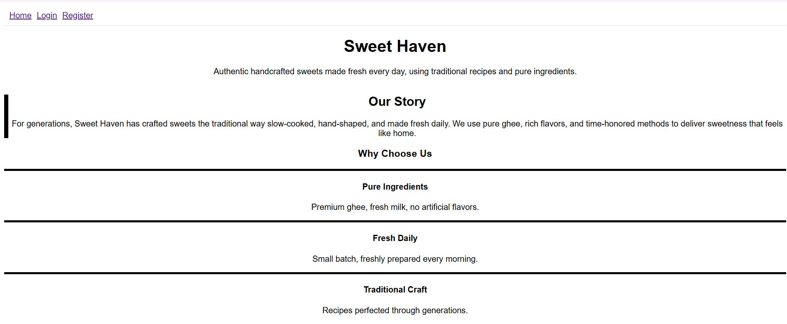
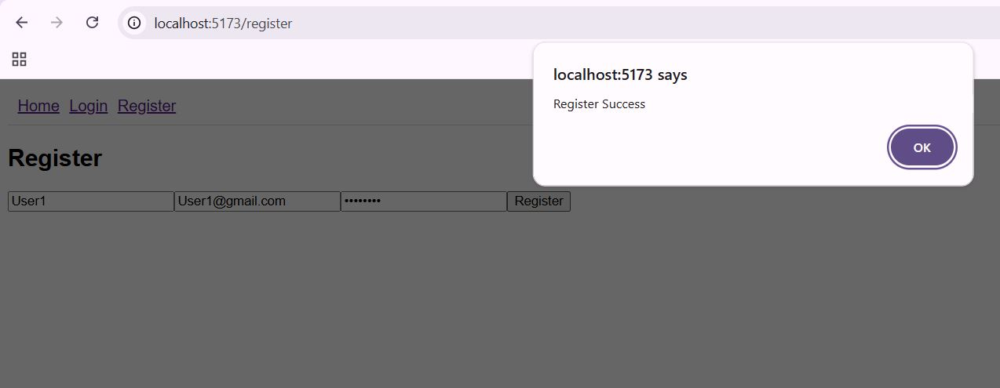
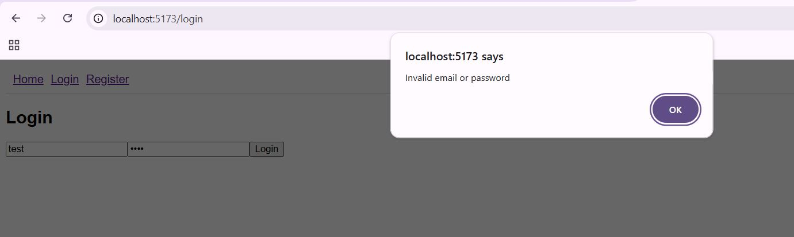
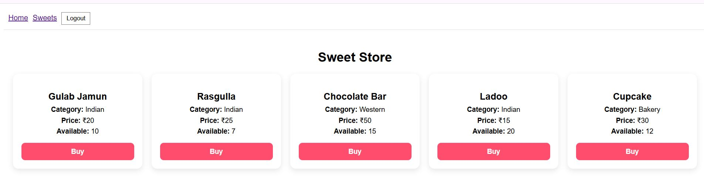
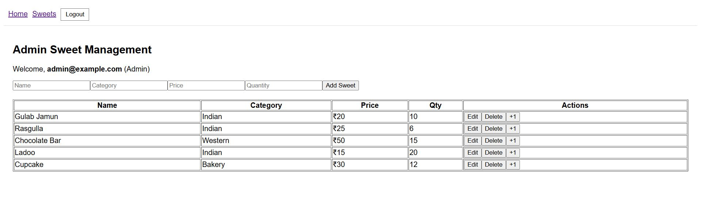
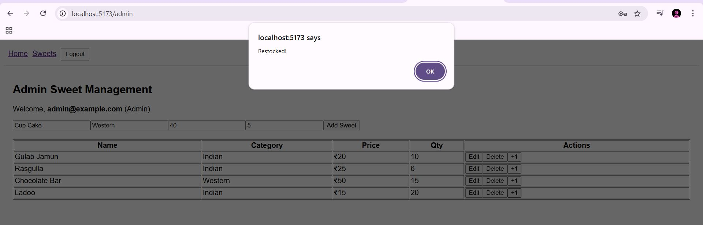

# Sweet Shop Management System

A full-stack Sweet Shop Management System built using Test-Driven Development (TDD).  
Supports user authentication, sweet inventory, purchase logic, and admin controls.

## Features

### User Capabilities
- Register and login with JWT authentication
- View all available sweets
- Search sweets by name, category, or price
- Purchase sweets (quantity decreases automatically)
- Purchase button disabled if quantity is zero

### Admin Capabilities
- Add sweets
- Edit sweets
- Delete sweets
- Restock sweets
- Access protected admin routes & dashboard

## Tech Stack

| Layer | Technology |
|------|-----------|
Frontend | React (Vite)
Backend | Node.js + Express
Database | SQLite + Prisma ORM
Auth | JWT-based token system
Testing | Jest + Supertest (Backend)
Version Control | Git + GitHub

## Project Folder Structure

```
root
 ├── backend
 │   ├── src
 │   │   ├── controllers
 │   │   ├── routes
 │   │   ├── middleware
 │   │   ├── prisma
 │   │   └── tests
 └── frontend
     └── src
         ├── components
         ├── pages
         └── services
```

---

## Backend Setup Instructions

```
cd backend
npm install
```

Create a `.env` in the backend folder:

```
DATABASE_URL="file:./dev.db"
JWT_SECRET="your-secret-key"
```

Initialize Prisma DB:

```
npx prisma migrate dev
```

Run backend server:

```
npm run dev
```

---

## Frontend Setup Instructions

```
cd frontend
npm install
npm run dev
```

---

## Running Tests

```
cd backend
npm run test
```


---

## Screenshots











---

## My AI Usage

### Tools Used
ChatGPT

### How I Used AI
- Asked guidance for structuring API endpoints and comments
- Requested explanations and documentation help
- Used AI to clarify testing patterns for Jest & Supertest
- Generated inline code comments for better readability
- Helped me write README sections

### Reflection
AI was used to support learning and speed up development, not replace my work.  
I implemented business logic, wrote components, and tested features myself.  
AI improved productivity and clarity by acting like a mentor and debugging partner.


---

## AI Co-Author Commit Policy

Whenever AI assistance influenced code, commit format included:

```
feat: implemented sweet update functionality

Used AI suggestions for function documentation and clarity.

Co-authored-by: ChatGPT <noreply@openai.com>
```

---

## Future Improvements

- Deployment on Vercel / Render
- Add UI test automation
- Add sales analytics dashboard
- Add order history for users

---

## Author Information

Name: Smitha Nayak 
Email: nayak.smitha.work@gmail.com  
GitHub: https://github.com/CodeLoom319

